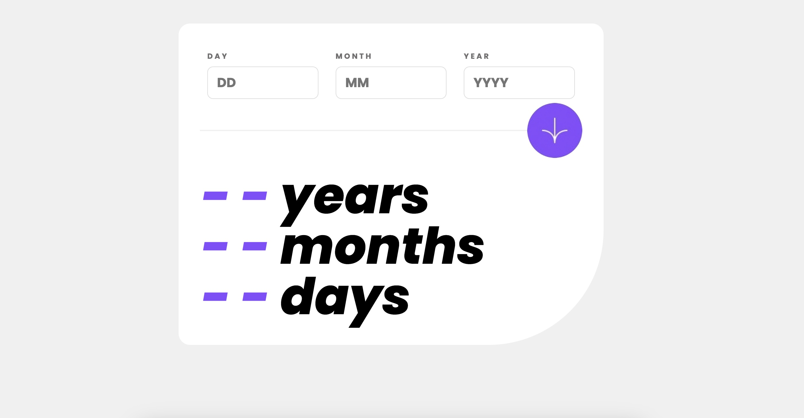

# Frontend Mentor - Age calculator app solution

This is a solution to the [Age calculator app challenge on Frontend Mentor](https://www.frontendmentor.io/challenges/age-calculator-app-dF9DFFpj-Q). Frontend Mentor challenges help you improve your coding skills by building realistic projects. 

## Table of contents

- [Overview](#overview)
  - [The challenge](#the-challenge)
  - [Screenshot](#screenshot)
  - [Links](#links)
- [Getting started](#getting-started)  
- [My process](#my-process)
  - [Built with](#built-with)
  - [Continued development](#continued-development)
  - [Useful resources](#useful-resources)
- [Author](#author)

## Overview

### The challenge

Users should be able to:

- View an age in years, months, and days after submitting a valid date through the form
- Receive validation errors if:
  - Any field is empty when the form is submitted
  - The day number is not between 1-31
  - The month number is not between 1-12
  - The year is in the future
  - The date is invalid e.g. 31/04/1991 (there are 30 days in April)
- View the optimal layout for the interface depending on their device's screen size
- See hover and focus states for all interactive elements on the page

### Screenshot



### Links

- Live Site URL: [Add live site URL here](https://doehna.github.io/age-calculator/)

## Getting started

To get a local copy up and running follow these simple example steps.

### Prerequisites

npm
```npm install -g npm```

### Installation

- Clone the repo
git clone https://github.com/doehna/age-calculator.git

- Install NPM packages
```npm install```


## My process

### Built with

- Semantic HTML5 markup
- JavaScript
- CSS custom properties
- Flexbox

### Useful resources

- date-fns

## Author

- Website - [Dorota Wojdecka](https://github.com/doehna)
- Frontend Mentor - [@doehna](https://www.frontendmentor.io/profile/doehna)

## Acknowledgments

This is where you can give a hat tip to anyone who helped you out on this project. Perhaps you worked in a team or got some inspiration from someone else's solution. This is the perfect place to give them some credit.

**Note: Delete this note and edit this section's content as necessary. If you completed this challenge by yourself, feel free to delete this section entirely.**
